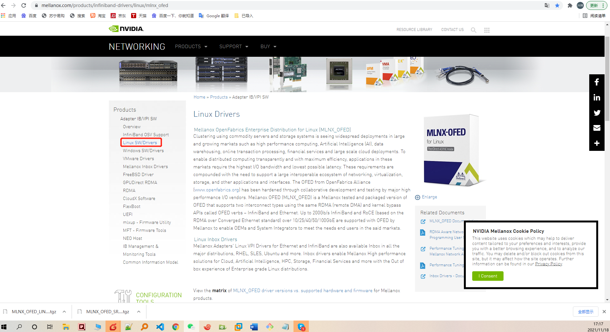
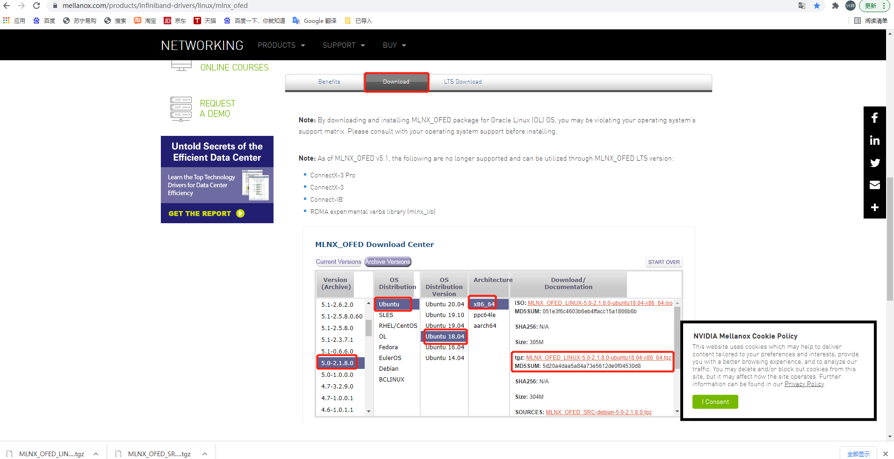
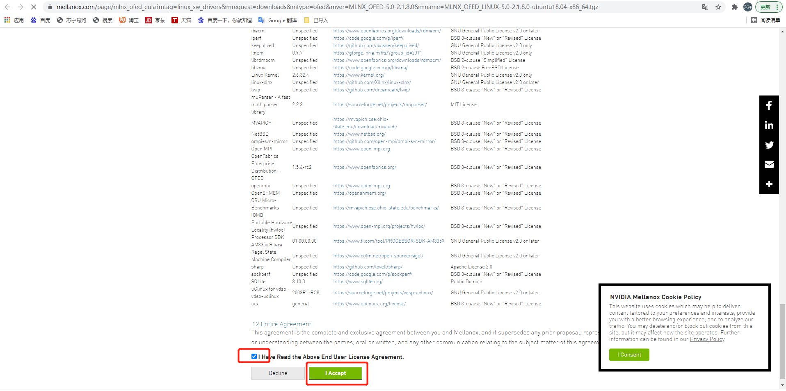

# ubuntu18.04系统中配置NVMe-oF

## 1.环境准备
linux系统可以是运行在物理机上，也可以是虚拟机上，本次是运行在虚拟机上。
建议有2个linux系统，一个做host，一个做target，如果资源紧张也可以把host和target运行在一个linux系统里，本次host、target都同一个系统里。
### 1.1 安装 ubuntu18.04

    ```
    root@ubuntu:~# uname -a
    Linux ubuntu 5.4.0-42-generic #46~18.04.1-Ubuntu SMP Fri Jul 10 07:21:24 UTC 2020 x86_64 x86_64 x86_64 GNU/Linux
    root@ubuntu:~# 
    ```
    
### 1.2 安装nvme-cli

    `apt install nvme-cli`
    
### 1.3 编译安装MLNX_OFED_LINUX驱动

    驱动下载地址：https://www.mellanox.com/products/infiniband-drivers/linux/mlnx_ofed
    
    
    
    
    
    
    
    
    编译安装：
    
    ```
    # 解压编译安装
    tar -zxvf MLNX_OFED_LINUX-5.0-2.1.8.0-ubuntu18.04-x86_64.tgz   
    cd MLNX_OFED_LINUX-5.0-2.1.8.0-ubuntu18.04-x86_64
    ./mlnxofedinstall --with-nvmf --force --add-kernel-support
    # 加载相关驱动内核模块
    modprobe nvmet
    modprobe nvmet-rdma
    modprobe nvmet-tcp
    modprobe nvme-fabrics
    modprobe nvme_core
    # 加载检查
    root@ubuntu:~# lsmod |grep nvme
    nvme_fabrics           24576  0
    nvme_core             106496  1 nvme_fabrics
    nvmet_tcp              24576  0
    nvmet_rdma             28672  0
    rdma_cm                65536  1 nvmet_rdma
    ib_core               311296  4 rdma_cm,nvmet_rdma,iw_cm,ib_cm
    nvmet                  81920  2 nvmet_tcp,nvmet_rdma
    root@ubuntu:~# 
    
    root@ubuntu:~# tree  /sys/kernel/config/
    /sys/kernel/config/
    ├── nvmet
    │   ├── hosts
    │   ├── ports
    │   └── subsystems
    ├── pci_ep
    │   ├── controllers
    │   └── functions
    └── rdma_cm

    8 directories, 0 files
    root@ubuntu:~# 

    ```
    
    安装编译的时候遇到报错，查看日志是因为系统自带的python3，而编译的脚本使用了python2的语法，因此报错，解决办法是在系统中安装了一下python：`apt install python`
    
 ### 1.4 准备一块磁盘

    ```
    root@ubuntu:~# fdisk -l /dev/sdb 
    Disk /dev/sdb: 20 GiB, 21474836480 bytes, 41943040 sectors
    Units: sectors of 1 * 512 = 512 bytes
    Sector size (logical/physical): 512 bytes / 512 bytes
    I/O size (minimum/optimal): 512 bytes / 512 bytes
    root@ubuntu:~# 
    ```

## 2.配置NVMe over TCP

### 2.1 创建NVMe subsystem

    ```
    cd /sys/kernel/config/nvmet/subsystems
    mkdir nqn.2021-11.org.nvmexpress.mytest
    root@ubuntu:/sys/kernel/config/nvmet/subsystems# tree nqn.2021-11.org.nvmexpress.mytest
    nqn.2021-11.org.nvmexpress.mytest
    ├── allowed_hosts
    ├── attr_allow_any_host
    ├── attr_serial
    ├── attr_version
    └── namespaces

    2 directories, 3 files
    root@ubuntu:/sys/kernel/config/nvmet/subsystems# 
    ```
    
### 2.2 设置NVMe subsystem允许访问的主机

    ```
    cd nqn.2021-11.org.nvmexpress.mytest
    # 设置了允许所有主机访问
    echo 1 > attr_allow_any_host
    root@ubuntu:/sys/kernel/config/nvmet/subsystems/nqn.2021-11.org.nvmexpress.mytest# cat  attr_allow_any_host
    1
    root@ubuntu:/sys/kernel/config/nvmet/subsystems/nqn.2021-11.org.nvmexpress.mytest#     
    ```
    
### 2.3 申请NSID

    ```
    cd namespaces/
    # 直接使用准备申请的NSID作为目录名创建目录
    mkdir 1 
    ```
    
### 2.4 向NSID上挂载存储设备

    ```
    cd 1
    # 这里关联的存储设备是/dev/sdb
    echo "/dev/sdb" > device_path
    echo 1 > enable
    ```
    
### 2.5 创建NVMe over TCP的Transport层

    ```
    cd /sys/kernel/config/nvmet/ports
    mkdir 123
    cd 123
    # 设置这些属性
    echo tcp > addr_trtype
    echo ipv4 > addr_adrfam
    # 192.168.239.131是本机的IP地址，配置时根据实际情况修改
    echo 192.168.239.131 > addr_traddr
    echo 4420 > addr_trsvcid   
    ```
    
### 2.6 让Transport与NVMe subsystem建立关联

    ```
    cd subsystems/
    ln -s ../../../subsystems/nqn.2021-11.org.nvmexpress.mytest tcpsubsys
    # 查看软件链接成功
    root@ubuntu:/sys/kernel/config/nvmet/ports/123/subsystems# ls -l
    total 0
    lrwxrwxrwx 1 root root 0 Nov 18 18:28 tcpsubsys -> ../../../../nvmet/subsystems/nqn.2021-11.org.nvmexpress.mytest
    root@ubuntu:/sys/kernel/config/nvmet/ports/123/subsystems#
    # 如果都执行成功，使用netstat -ltnp命令就可以看到4420端口正在运行着帧听服务
    root@ubuntu:/sys/kernel/config/nvmet/ports/123/subsystems# netstat -ltnp |grep 4420
    tcp        0      0 192.168.239.131:4420    0.0.0.0:*               LISTEN      -                   
    root@ubuntu:/sys/kernel/config/nvmet/ports/123/subsystems# 
    ```
   
### 2.7 在host主机进行Discovery

    ```
    # 在host端执行命令，当前例子host端也是tartget端，因此就是当前节点执行，-a IP -s 端口即为2.5中配置进行的IP和端口
    nvme discover -t tcp -a 192.168.239.131 -s 4420
    
    root@ubuntu:/sys/kernel/config/nvmet/ports/123/subsystems# nvme discover -t tcp -a 192.168.239.131 -s 4420

    Discovery Log Number of Records 1, Generation counter 2
    =====Discovery Log Entry 0======
    trtype:  unrecognized
    adrfam:  ipv4
    subtype: nvme subsystem
    treq:    unrecognized
    portid:  123
    trsvcid: 4420
    subnqn:  nqn.2021-11.org.nvmexpress.mytest
    traddr:  192.168.239.131
    root@ubuntu:/sys/kernel/config/nvmet/ports/123/subsystems#
    ```
    
### 2.8 在host主机进行连接

    ```
    # 在host端执行命令，当前例子host端也是tartget端，因此就是当前节点执行，-a IP -s 端口即为2.5中配置进行的IP和端口
    nvme connect -t tcp -a 192.168.239.131 -s 4420 -n nqn.2021-11.org.nvmexpress.mytest
    root@ubuntu:/sys/kernel/config/nvmet/ports/123# nvme list
    Node             SN                   Model                                    Namespace Usage                      Format           FW Rev  
    ---------------- -------------------- ---------------------------------------- --------- -------------------------- ---------------- --------
    /dev/nvme0n1     409ec5fe9ccf74bc     Linux                                    1          21.47  GB /  21.47  GB    512   B +  0 B   5.4.0-90
    root@ubuntu:/sys/kernel/config/nvmet/ports/123# 
    ```
    
### 2.9 关闭连接

    ```
    root@ubuntu:/sys/kernel/config/nvmet/ports/123# nvme disconnect -n nqn.2021-11.org.nvmexpress.mytest
    NQN:nqn.2021-11.org.nvmexpress.mytest disconnected 1 controller(s)
    root@ubuntu:/sys/kernel/config/nvmet/ports/123# nvme list
    Node             SN                   Model                                    Namespace Usage                      Format           FW Rev  
    ---------------- -------------------- ---------------------------------------- --------- -------------------------- ---------------- --------
    root@ubuntu:/sys/kernel/config/nvmet/ports/123# 

    ```
    
## 3.配置NVMe over RDMA （需要支持RDMA网卡）

### 3.1 创建NVMe subsystem

    ```
    mkdir /sys/kernel/config/nvmet/subsystems/nvme-subsystem-name
    cd /sys/kernel/config/nvmet/subsystems
    root@lllr25n01:/sys/kernel/config/nvmet/subsystems# tree nvme-subsystem-name
    nvme-subsystem-name
    ├── allowed_hosts
    ├── attr_allow_any_host
    ├── attr_offload
    ├── attr_offload_subsys_unknown_ns_cmds
    ├── attr_serial
    ├── attr_version
    └── namespaces

    2 directories, 5 files
    root@lllr25n01:/sys/kernel/config/nvmet/subsystems#   
    ```
    
### 3.2 设置NVMe subsystem允许访问的主机

    ```
    cd nvme-subsystem-name/
    # 设置了允许所有主机访问
    echo 1 > attr_allow_any_host
    root@lllr25n01:/sys/kernel/config/nvmet/subsystems/nvme-subsystem-name# cat  attr_allow_any_host
    1
    root@lllr25n01:/sys/kernel/config/nvmet/subsystems/nvme-subsystem-name#
    ```
    
### 3.3 申请NSID

    ```
    cd namespaces/
    # 直接使用准备申请的NSID作为目录名创建目录
    mkdir 10 
    ```
    
### 3.4 向NSID上挂载存储设备

    ```
    cd 10
    # 这里关联的存储设备是/dev/sdb
    echo "/dev/sdb" > device_path
    echo 1 > enable
    ```
    
### 3.5 创建NVMe over RDMA的Transport层

    ```
    cd /sys/kernel/config/nvmet/ports
    mkdir 123
    cd 123
    # 设置这些属性
    echo rdma > addr_trtype
    echo ipv4 > addr_adrfam
    # 192.168.102.25 是本机的IP地址，配置时根据实际情况修改
    echo 192.168.102.25 > addr_traddr
    echo 4420 > addr_trsvcid   
    ```
    
### 3.6 让Transport与NVMe subsystem建立关联

    ```
    cd subsystems/
    ln -s ../../../subsystems/nvme-subsystem-name nvme-subsystem-name
    # 查看软件链接成功
    root@lllr25n01:/sys/kernel/config/nvmet/ports/123/subsystems# ls -l
    total 0
    lrwxrwxrwx 1 root root 0 Nov 19 12:16 nvme-subsystem-name -> ../../../../nvmet/subsystems/nvme-subsystem-name
    root@lllr25n01:/sys/kernel/config/nvmet/ports/123/subsystems# 
    # 如果都执行成功，查看日志有如下输出
    root@lllr25n01:/sys/kernel/config/nvmet/ports/123/subsystems# dmesg |grep nvmet_rdma
    [4501724.133563] nvmet_rdma: enabling port 123 (192.168.102.25:4420)
    root@lllr25n01:/sys/kernel/config/nvmet/ports/123/subsystems# 
    ```
   
### 3.7 在host主机进行Discovery

    ```
    # 在host端执行命令，当前例子host端也是tartget端，因此就是当前节点执行，-a IP -s 端口即为2.5中配置进行的IP和端口
    nvme discover -t rdma -a 192.168.102.25 -s 4420
    
    root@lllr25n01:/sys/kernel/config/nvmet/ports/123/subsystems# nvme discover -t rdma tcp -a 192.168.102.25 -s 4420

    Discovery Log Number of Records 1, Generation counter 23
    =====Discovery Log Entry 0======
    trtype:  rdma
    adrfam:  ipv4
    subtype: nvme subsystem
    treq:    not specified, sq flow control disable supported
    portid:  123
    trsvcid: 4420
    subnqn:  nvme-subsystem-name
    traddr:  192.168.102.25
    rdma_prtype: not specified
    rdma_qptype: connected
    rdma_cms:    rdma-cm
    rdma_pkey: 0x0000
    ```
    
### 2.8 在host主机进行连接

    ```
    # 在host端执行命令，当前例子host端也是tartget端，因此就是当前节点执行，-a IP -s 端口即为2.5中配置进行的IP和端口
    nvme connect -t tcp -a 192.168.239.131 -s 4420 -n nqn.2021-11.org.nvmexpress.mytest
    root@lllr25n01:/sys/kernel/config/nvmet/ports/123/subsystems# nvme connect -t rdma -a  192.168.102.25 -s 4420 -n  nvme-subsystem-name
    root@lllr25n01:/sys/kernel/config/nvmet/ports/123/subsystems# nvme list
    Node             SN                   Model                                    Namespace Usage                      Format           FW Rev  
    ---------------- -------------------- ---------------------------------------- --------- -------------------------- ---------------- --------
    /dev/nvme4n1     2f115fe029ed2daa     Linux                                    10        137.44  GB / 137.44  GB    512   B +  0 B   4.15.0-5
    root@lllr25n01:/sys/kernel/config/nvmet/ports/123/subsystems# 
    ```
    
### 2.9 关闭连接

    ```
    root@lllr25n01:/sys/kernel/config/nvmet/ports/123/subsystems# nvme disconnect -n nvme-subsystem-name
    NQN:nvme-subsystem-name disconnected 1 controller(s)
    root@lllr25n01:/sys/kernel/config/nvmet/ports/123/subsystems# nvme list
    Node             SN                   Model                                    Namespace Usage                      Format           FW Rev  
    ---------------- -------------------- ---------------------------------------- --------- -------------------------- ---------------- --------
    root@lllr25n01:/sys/kernel/config/nvmet/ports/123/subsystems# 
    ```
    
 ## 参考链接：
https://community.mellanox.com/s/article/howto-configure-nvme-over-fabrics
